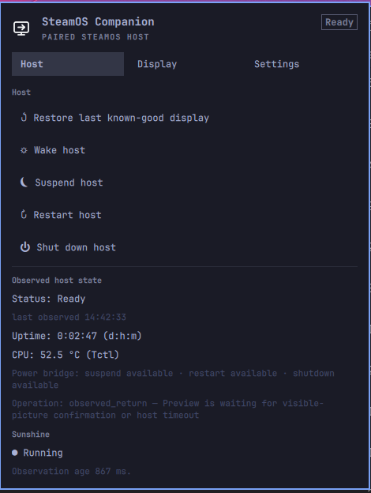
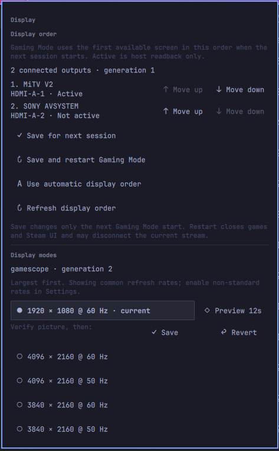
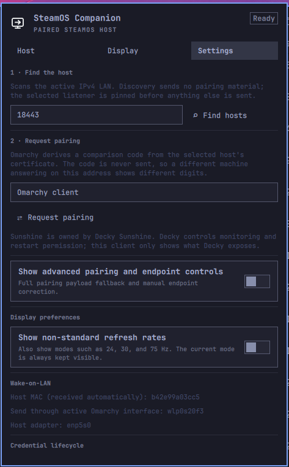

# SteamOS Remote — Omarchy client

SteamOS Remote is an Omarchy bar widget for a paired SteamOS Remote Decky
host. It discovers and pairs with the host, shows its status, wakes it, sends
power commands, and provides display recovery. Sunshine status and restart are
shown only when monitoring is enabled on the host.

The Decky host is maintained separately in
[tuthan/decky-steam-remote](https://github.com/tuthan/decky-steam-remote).

- Plugin ID: `io.github.tuthan.steamosremote`
- License: [MIT](LICENSE)

## Screenshots







## Install

Install from a reviewed checkout or repository:

```sh
omarchy plugin add https://github.com/tuthan/omarchy-steam-remote.git --enable
```

The Decky host must be installed and running before pairing.

## Pair and use

1. Open the widget’s **Settings** and choose **Find hosts**.
2. Select the intended host, choose **Request pairing**, compare the code with
   the one shown by the Decky plugin, and approve it on the Deck.
3. Use **Host** for status, wake, suspend, restart, and shutdown.
4. Use **Display** to preview, save, or revert a display mode. When the host
   exposes display-order control, you can also reorder connected outputs, save
   that order for the next session, or save it and restart Gaming Mode after
   confirmation.

The host listens on all IPv4 interfaces by default. Set its host/IP override
only when it has multiple network interfaces. Sunshine monitoring is disabled
by default and is controlled from Decky settings. When it is disabled, the
client does not show Sunshine controls or request a separate Sunshine poll;
the normal status read remains the source of truth for all remote capabilities.

## Security

The client requires the system `python3` interpreter and uses only its standard
library. The bundled helper sends credentials only over HTTPS after checking
the paired host's certificate fingerprint. Compare the pairing codes on both
devices before approving a new host.

Credentials and pending requests are stored under
`${XDG_STATE_HOME:-~/.local/state}/steamos-remote` in private files. Symlinked
state directories/ancestors and unsafe shared paths are refused. Network data
and helper output have explicit size limits; oversized responses are rejected.

See the [marketplace feedback review and release checklist](docs/security-review.md)
for the checked patterns, regression tests, and remaining validation limits.

## Local development

Validate the plugin from this directory:

```sh
python3 -m unittest discover -s tests -p 'test_*.py' -v
omarchy plugin validate .
qmllint Panel.qml
```

To install the current checkout for testing, sync it into Omarchy’s real
plugin directory and rescan the shell:

```sh
plugin_dir="$HOME/.config/omarchy/plugins/io.github.tuthan.steamosremote"
mkdir -p "$(dirname "$plugin_dir")"
if [ -L "$plugin_dir" ]; then unlink "$plugin_dir"; fi
mkdir -p "$plugin_dir"
rsync -a --delete --exclude='.git/' ./ "$plugin_dir"/
omarchy-shell shell rescanPlugins
omarchy plugin enable io.github.tuthan.steamosremote --section right
```

Repeat the `rsync` and rescan commands after changes.

## Remove

```sh
omarchy plugin disable io.github.tuthan.steamosremote
omarchy plugin remove io.github.tuthan.steamosremote
```

Removing the plugin does not remove its pairing credentials. Use **Forget
local pairing** in the widget settings if those credentials should also be
deleted.
